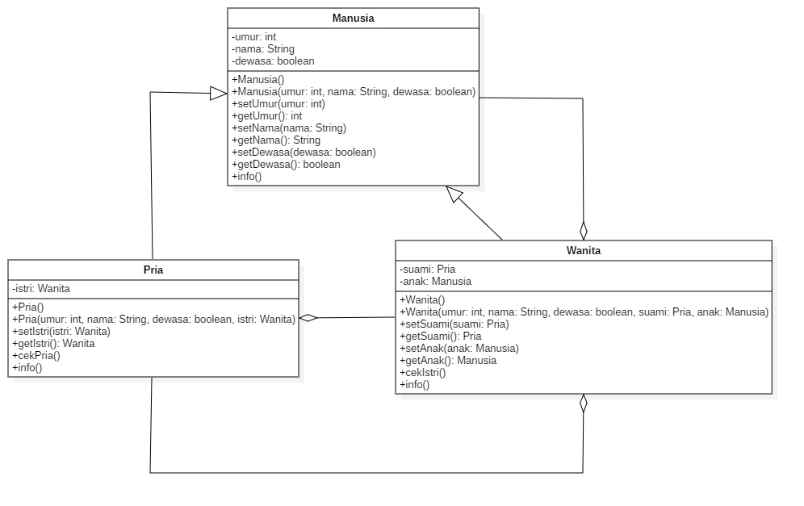
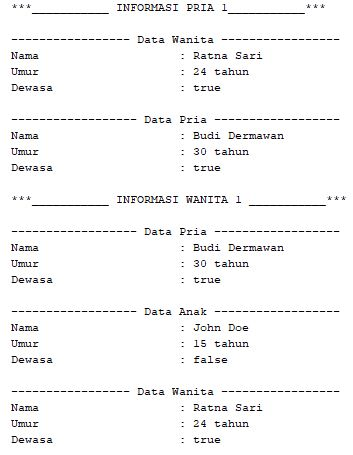
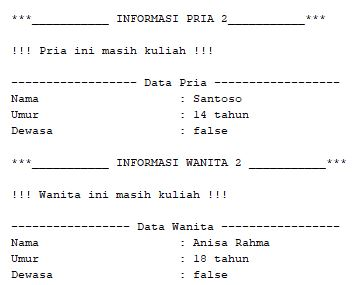

# Soal Kuis

--Studi Kasus --

Terdapat class Manusia yang memiliki atribut umur(int), nama(String), dan dewasa(boolean) yang berjenis modifier private. Method yang dimiliki class manusia adalah setter dan getter setiap atribut serta method info sebagai pencetak informasi data yang dimasukkan di atribut tersebut. class Manusia ini mewarisi ke class Pria dan class Wanita. class Manusia memiliki dua konstruktor yaitu default dan konstruktor dengan parameter sejumlah tiga (int umur, String nama, boolean dewasa).

Class Pria memiliki sebuah atribut private dengan nama istri berjenis Wanita. Adapun set umur, nama, dan dewasa mengikuti class Manusia. Berikan sebuah operasi dalam bentuk method untuk aturan jika usia Pria lebih dari sama dengan 22 maka Pria ini dianggap dewasa (harus memiliki istri) dengan nilai mengambil dari class Wanita, jika kurang dari 22 maka set kalimat "Pria ini masih kuliah". Berikan method info untuk mencetak informasi class Pria. Buat dua konstruktor yaitu default dan konstruktir dengan parameter (int umur, String nama, boolean dewasa, Wanita istri).

Class wanita memiliki atribut private bernama suami dengan jenis Pria dan anak dengan jenis Manusia. Jika Wanita telah berusia lebih dari sama dengan 20, maka Wanita ini telah dianggap memiliki suami dengan mengambil nilai pada class Pria dan memiliki anak dengan mengambil nilai pada class Manusia, jika usia kurang dari 20 maka set kalimat "Wanita ini masih kuliah". Berikan method info untuk mencetak informasi class Wanita. Buat dua konstruktor yaitu default dan konstruktor dengan paramater (int umur, String nama, boolean dewasa, Pria suami, Manusia anak).

# DIAGRAM CLASS



# KODE PROGRAM

> Class Manusia

```
package Kuis;

/**
 *
 * @author Syaifuddin
 */

public class Manusia {
    private int umur;
    private String nama;
    private boolean dewasa;

    public Manusia() {
    }

    public Manusia(int umur, String nama, boolean dewasa) {
        this.umur = umur;
        this.nama = nama;
        this.dewasa = dewasa;
    }

    public int getUmur() {
        return umur;
    }

    public void setUmur(int umur) {
        this.umur = umur;
    }

    public String getNama() {
        return nama;
    }

    public void setNama(String nama) {
        this.nama = nama;
    }

    public boolean isDewasa() {
        return dewasa;
    }

    public void setDewasa(boolean dewasa) {
        this.dewasa = dewasa;
    }

    public void info(){
        System.out.println("Nama\t\t\t: " + this.nama);
        System.out.println("Umur\t\t\t: " + this.umur + " tahun");
        System.out.println("Dewasa\t\t\t: " + this.dewasa);
    }
}
```

> Class Pria

```
package Kuis;

/**
 *
 * @author Syaifuddin
 */

public class Pria extends Manusia{
    private Wanita istri;

    public Pria() {
    }

    public Pria(Wanita istri) {
        this.istri = istri;
    }

    public Pria(Wanita istri, int umur, String nama, boolean dewasa) {
        super(umur, nama, dewasa);
        this.istri = istri;
    }


    public Wanita getIstri() {
        return istri;
    }

    public void setIstri(Wanita istri) {
        this.istri = istri;
    }

    public void cekPria(){
        if(super.getUmur() >= 22){
            if(istri != null){
                super.setDewasa(true);
                istri.setDewasa(true);
                istri.info();
            } else {
                super.setDewasa(true);
                System.out.println("\n!!! Pria ini belum mempunyai istri !!!");
            }
        } else {
            super.setDewasa(false);
            System.out.println("\n!!! Pria ini masih kuliah !!!");
        }
    }

    public void info(){
        System.out.println("\n------------------ Data Pria ------------------");
        super.info();
    }
}
```

> Class Wanita

```
package Kuis;

/**
 *
 * @author Syaifuddin
 */

public class Wanita extends Manusia{
    private Pria suami;
    private Manusia anak;

    public Wanita() {
    }

    public Wanita(Pria suami, Manusia anak) {
        this.suami = suami;
        this.anak = anak;
    }

    public Wanita(Pria suami, Manusia anak, int umur, String nama, boolean dewasa) {
        super(umur, nama, dewasa);
        this.suami = suami;
        this.anak = anak;
    }

    public Pria getSuami() {
        return suami;
    }

    public void setSuami(Pria suami) {
        this.suami = suami;
    }

    public Manusia getAnak() {
        return anak;
    }

    public void setAnak(Manusia anak) {
        this.anak = anak;
    }

    public void cekIstri(){
        if(super.getUmur() >= 20){
            super.setDewasa(true);
            if(suami.getUmur() >= 22){
                suami.setDewasa(true);
            } else {
                suami.setDewasa(false);
            }
            suami.info();
            System.out.println("\n------------------ Data Anak ------------------");
            anak.info();
        } else {
            super.setDewasa(false);
            System.out.println("\n!!! Wanita ini masih kuliah !!!");
        }
    }

    public void info(){
        System.out.println("\n----------------- Data Wanita -----------------");
        super.info();
    }

}
```

> Class Demo

```
package Kuis;

/**
 *
 * @author Syaifuddin
 */

public class DemoKuis {
    public static void main(String[] args) {

        /** OBJEK 1 **/

        Pria p1 = new Pria();
        p1.setNama("Budi Dermawan");
        p1.setUmur(30);

        Wanita w1 = new Wanita();
        w1.setNama("Ratna Sari");
        w1.setUmur(24);

        Manusia anak1 = new Manusia(15, "John Doe", false);

        p1.setIstri(w1);
        w1.setSuami(p1);
        w1.setAnak(anak1);

        System.out.println("***___________ INFORMASI PRIA 1___________***");
        p1.cekPria();
        p1.info();

        System.out.println("\n***___________ INFORMASI WANITA 1 ___________***");
        w1.cekIstri();
        w1.info();

        /** OBJEK 2 **/

        Pria p2 = new Pria();
        p2.setNama("Santoso");
        p2.setUmur(14);

        Wanita w2 = new Wanita();
        w2.setNama("Anisa Rahma");
        w2.setUmur(18);

        Manusia anak2 = new Manusia(25, "Alexander", true);

        p2.setIstri(w2);
        w2.setSuami(p2);
        w2.setAnak(anak2);

        System.out.println("***___________ INFORMASI PRIA 2___________***");
        p2.cekPria();
        p2.info();

        System.out.println("\n***___________ INFORMASI WANITA 2 ___________***");
        w2.cekIstri();
        w2.info();
    }
}
```

# OUTPUT PROGRAM

> Objek 1



> Objek 2


