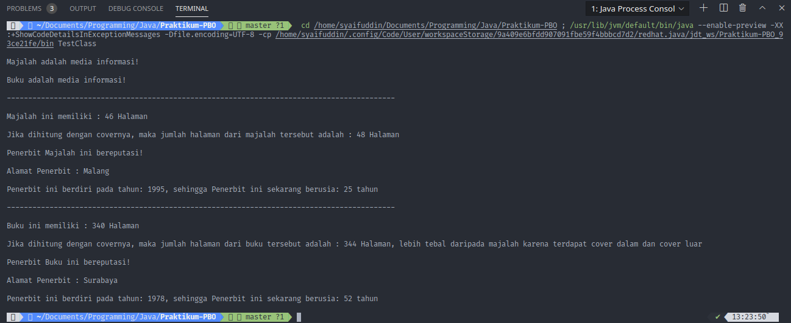

# LAPORAN KUIS 2 PRAKTIKUM PBO

## Source Code tiap Class

> Class Penerbit

```
public interface Penerbit {
  public void reputasi();

  public void alamatPenerbit(String alamat);

  public void tahunBerdiri(int tahun);
}
```

> Class Media Informasi

```
public class MediaInformasi implements Penerbit {

  public int jmlHalaman;
  private int tahunSekarang;

  public int getTahunSekarang(int tahun) {
    this.tahunSekarang = tahun;
    return this.tahunSekarang;
  }

  public void setJmlHalaman(int jml) {
    this.jmlHalaman = jml;
  }

  public void reputasi() {
  }

  public void alamatPenerbit(String alamat) {
    System.out.println("\nAlamat Penerbit : " + alamat);
  }

  public void tahunBerdiri(int tahun) {
    System.out.println("\nPenerbit ini berdiri pada tahun: " + tahun + ", sehingga Penerbit ini sekarang berusia: "
        + (this.tahunSekarang - tahun) + " tahun");
  }
}
```

> Class Majalah

```
public class Majalah extends MediaInformasi {
  @Override
  public void setJmlHalaman(int jml) {
    super.setJmlHalaman(jml);
    int totalHalaman = super.jmlHalaman + 2;
    System.out.println("Majalah ini memiliki : " + super.jmlHalaman + " Halaman\n");
    System.out.println("Jika dihitung dengan covernya, maka jumlah halaman dari majalah tersebut adalah : "
        + totalHalaman + " Halaman");
  }

  @Override
  public void reputasi() {
    System.out.println("\nPenerbit Majalah ini bereputasi!");
  }
}
```

> Class Buku

```
public class Buku extends MediaInformasi {

  @Override
  public void setJmlHalaman(int jml) {
    super.setJmlHalaman(jml);
    int totalHalaman = super.jmlHalaman + 4;
    System.out.println("Buku ini memiliki : " + super.jmlHalaman + " Halaman\n");
    System.out.println("Jika dihitung dengan covernya, maka jumlah halaman dari buku tersebut adalah : " + totalHalaman
        + " Halaman, lebih tebal daripada majalah karena terdapat cover dalam dan cover luar");
  }

  @Override
  public void reputasi() {
    System.out.println("\nPenerbit Buku ini bereputasi!");
  }
}
```

> Class TestClass

```
public class TestClass {
  public static void Proses(MediaInformasi med) {
    if (med instanceof Majalah) {
      System.out.println("\nMajalah adalah media informasi!\n");
    } else if (med instanceof Buku) {
      System.out.println("Buku adalah media informasi!\n");
    } else {
      System.out.println("Kategori belum diketahui!");
    }
  }

  public static void main(String[] args) {
    Majalah maj = new Majalah();
    Buku buk = new Buku();
    Proses(maj);
    Proses(buk);

    System.out.println("-------------------------------------------------------------------------------------------\n");

    MediaInformasi medMaj = new Majalah();
    medMaj.setJmlHalaman(46);
    medMaj.reputasi();
    medMaj.alamatPenerbit("Malang");
    int tahunSekarang = medMaj.getTahunSekarang(2020);
    medMaj.tahunBerdiri(1995);

    System.out
        .println("\n-------------------------------------------------------------------------------------------\n");

    MediaInformasi medBuk = new Buku();
    medBuk.setJmlHalaman(340);
    medBuk.reputasi();
    medBuk.alamatPenerbit("Surabaya");
    medBuk.getTahunSekarang(2030);
    medBuk.tahunBerdiri(1978);
  }
}
```

## Output Program


