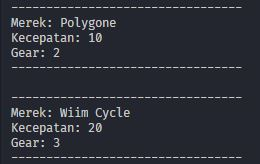
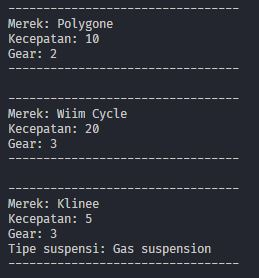

# PERCOBAAN | PERTEMUAN 1

## Percobaan 1

> Output Program Code

## Percobaan 2

> Output Program Code

## Pertanyaan

**1. Jelaskan perbedaan antara objek dengan class!**\
 **Jawab :**\
 Objek adalah pemanfaatan atau perwujudan dari class yang siap untuk digunakan.
Class adalah kumpulan dari suatu fungsi-fungsi atau method yang dibuat untuk suatu tujuan tertentu. Selain itu class juga bisa diartikan sebagai rancangan atau design dari suatu objek.

2. Jelaskan alasan warna dan tipe mesin dapat menjadi atribut dari objek mobil!
   Jawab :
   Sesuatu yang ada didalam objek bisa dijadikan atribut apabila itu adalah bagian dari ciri-ciri dari objek tersebut. Atau sesuatu yang bisa mendefinisikan objek tersebut secara deatil.

3. Sebutkan salah satu kelebihan utama dari pemrograman berorientasi objek dibandingkan
   dengan pemrograman struktural!
   Jawab :
   Dengan menggunakan PBO, kita akan dimudahkan dalam membuat suatu program yang membutuhkan banyak data dalam satu objek. Karena dalam konsep PBO, kita hanya perlu membuat satu class dimana didalamnya terdapat method-method yang dapat menjalankan sesuatu terhadap objek tersebut.

4. Apakah diperbolehkan melakukan pendefinisian dua buah atribut dalam satu baris kode seperti
   “public String nama,alamat;”?
   Jawab :
   Diperbolehkan karena menggunakan type data yang sama.

5. Pada class SepedaGunung, jelaskan alasan atribut merk, kecepatan, dan gear tidak lagi ditulis di
   dalam class tersebut!
   Jawab:
   Atribut diatas tidak dimasukkan ke class SepedaGunung karena dalam class SepedaGunung menggunakan Extends dari class Sepeda. Jadi method yang ada di class Sepeda bisa digunakan langsung di class SepedaGunung.
