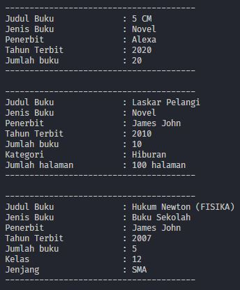
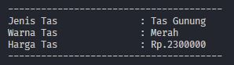
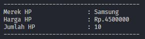

# PRAKTIKUM | PERTEMUAN 1

## Program Objek Buku

> Output Program Code

> Penjelasan

- Dalam program objek buku terdapat 3 _class_ diantaranya
  - _class_ Buku
  - _class_ BukuNovel
  - _class_ BukuSekolah
- _class_ Buku adalah _class_ utama atau _class_ yang mewarisi ke _child class_ nya yaitu BukuNovel dan BukuSekolah.
- _class_ BukuNovel dan BukuSekolah adalah _class_ yang diwarisi oleh _class_ Buku.

| Class       | Attribute                                                                     | Method                                                                                                                |
| ----------- | ----------------------------------------------------------------------------- | --------------------------------------------------------------------------------------------------------------------- |
| Buku        | - penerbit   - judulBuku   - jenisBuku   - tahunTerbit   - jumlah | - setPenerbit   - setJumlah   - setJenis   - setTahunTerbit   - setJudul   - setTambahBuku   - info |
| BukuNovel   | - kategori   - halaman                                                     | - setKategori   - setHalaman   - info                                                                           |
| BukuSekolah | - kelasBuku   - jenjang                                                    | - setBukuKelas   -setJenjang   - info                                                                           |

## Program Objek Tas

> Output Program Code

> Penjelasan

- Program objek tas ini hanya menggunakan 1 _class_ tanpa _inheritance class_ atau kelas warisan.

| Class | Attribute                         | Method                                    |
| ----- | --------------------------------- | ----------------------------------------- |
| Tas   | - harga   - jenis   - warna | - setHarga   - setWarna   -setJenis |

## Program Objek HP

> Output Program Code

> Penjelasan

- Program objek hp ini hanya menggunakan 1 _class_ tanpa _inheritance class_ atau kelas warisan

| Class | Attribute                            | Method                                     |
| ----- | ------------------------------------ | ------------------------------------------ |
| HP    | - harga   - jumlahHP   - merek | - setHarga   - setJumlah   -setMerek |
