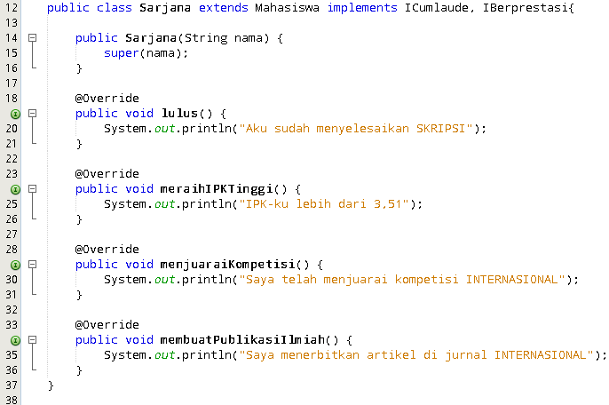

# LAPORAN PRAKTIKUM PBO || PERTEMUAN 11

## PERCOBAAN 1

> Output Program

> Modifikasi Program

Menghapus atau memberi komentar baris code `pakrektor.beriSertifikatCumlaude(mhsBiasa)`

### **PERTANYAAN**

1. Pada langkah ke 9, pada baris program ke 3 terdapat warning pada script tersebut. Jelaskan penyebab terjadinya hal tersebut ?
   

   **Jawab :** Terdapat warning dikarenakan baris kode tidak dibutuhkan atau tidak dipergunakan pada class tersebut.

2. Pada langkah ke 9, pada baris program ke 3. Apa yang terjadi jika script tersebut dihilangkan? Jelaskan menurut pemahaman anda.

   **Jawab :** Jika baris kode tersebut dihilangkan maka tidak akan terjadi apa-apa atau tidak akan mengakibatkan error.

3. Mengapa pada langkah nomor 9 terjadi error? Jelaskan!

   **Jawab :** Terjadi error dikarenakan pada method _beriSertifikatCumlaude()_ tersebut seharusnya berparameter object _ICumlaude_, sedangkan objek _mhsBiasa_ tersebut adalah instansiasi dari class Mahasiswa yang tidak menggunakan class _interface_ dari _ICumlaude_

4. Dapatkah method kuliahDiKampus() dipanggil dari objek sarjanaCumlaude di class Program? Mengapa demikian?

   **Jawab :** Method _kuliahDiKampus()_ dapat dapat dipanggil dari objek sarjanaCUmlaude dikarenakan objek tersebut adalah turunan dari class Mahasiswa;

   

   

5. Dapatkah method kuliahDiKampus() dipanggil dari parameter mahasiswa di method beriSertifikatCumlaude() pada class Rektor? Mengapa demikian?

   **Jawab :** Tidak bisa, dikarenakan paramater mada method tidak boleh bertype void.

6. Modifikasilah method beriSertifikatCumlaude() pada class Rektor agar hasil eksekusi class Program menjadi seperti berikut ini:
   

   **Jawab :**

   Menambahkan method abstract pada class _ICumlaude_

   

   Memanggil method _kuliahDiKampus()_ pada class Rektor

   

   Output Program

   

## PERCOBAAN 2

> Output Program

> Modifikasi Program

Menghapus atau menghilangkan baris kode berikut:

### **PERTANYAAN**

1. Pada script code interface IBerprestasi, modifikasi script tersebut sesuai
   dengan gambar dibawah ini :

Dari perubahan script diatas, apa yang terjadi ? serta jelaskan alasannya (capture hasilnya)

**Jawab :**

2. Perhatikan script code dibawah ini :
   
   Jelaskan menurut anda, mengapa hasil dari script code tersebut error ?

   **Jawab :** Baris kode tersebut error dikarenakan kode tersebut instansiasi dari class interface, sedangkan class interface sendiri itu tidak bisa digunakan pada proses instansiasi.

3. Apabila Sarjana Berprestasi harus menjuarai kompetisi NASIONAL dan menerbitkan artikel di jurnal NASIONAL, maka modifikasilah class-class yang terkait pada aplikasi Anda agar di class Program objek pakRektor dapat memberikan sertifikat mawapres pada objek sarjanaCumlaude.

**Jawab :**

- Menambahkan implements IBerprestasi pada class Sarjana

- Output Program

