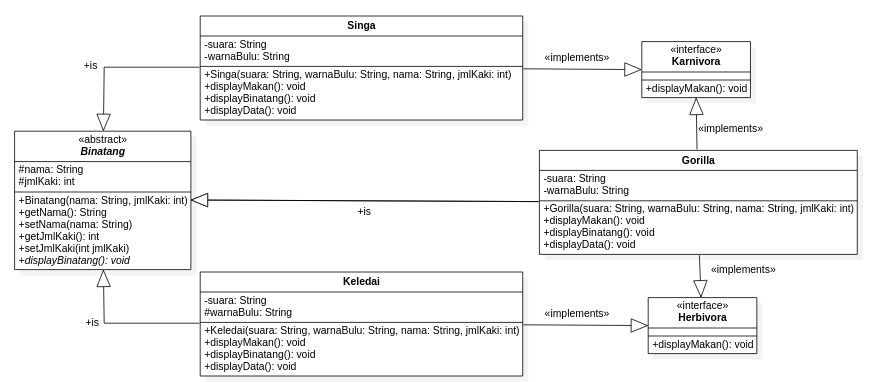
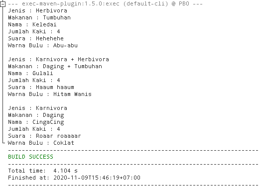

# LAPORAN TUGAS PRAKTIKUM PBO || PERTEMUAN 11

## **Class Diagram**



## **Source Code**

> Class Binatang

```
package tugasminggu11;

/**
 *
 * @author syaifuddin
 */
public abstract class Binatang {
    protected String nama;
    protected int jmlKaki;

    public Binatang(String nama, int jmlKaki) {
        this.nama = nama;
        this.jmlKaki = jmlKaki;
    }

    public String getNama() {
        return nama;
    }

    public void setNama(String nama) {
        this.nama = nama;
    }

    public int getJmlKaki() {
        return jmlKaki;
    }

    public void setJmlKaki(int jmlKaki) {
        this.jmlKaki = jmlKaki;
    }

    public void displayBinatang(){}
}
```

> Class Herbivora

```
package tugasminggu11;

/**
 *
 * @author syaifuddin
 */
public interface Herbivora {
    public abstract void displayMakan();
}
```

> Class Karnivora

```
package tugasminggu11;

/**
 *
 * @author syaifuddin
 */
public interface Karnivora {
    public abstract void displayMakan();
}
```

> Class Singa

```
package tugasminggu11;

/**
 *
 * @author syaifuddin
 */
public class Singa extends Binatang implements Karnivora{
    private String suara, warnaBulu;

    public Singa(String suara, String warnaBulu, String nama, int jmlKaki) {
        super(nama, jmlKaki);
        this.suara = suara;
        this.warnaBulu = warnaBulu;
    }

    @Override
    public void displayMakan() {
        System.out.println("Jenis : Karnivora");
        System.out.println("Makanan : Daging");
    }

    @Override
    public void displayBinatang() {
        System.out.println("Nama : " + super.getNama());
        System.out.println("Jumlah Kaki : " + super.getJmlKaki());
    }

    public void displayData(){
        System.out.println("Suara : " + this.suara);
        System.out.println("Warna Bulu : " + this.warnaBulu);
    }
}
```

> Class Keledai

```
package tugasminggu11;

/**
 *
 * @author syaifuddin
 */
public class Keledai extends Binatang implements Herbivora{

    private String suara, warnaBulu;

    public Keledai(String suara, String warnaBulu, String nama, int jmlKaki) {
        super(nama, jmlKaki);
        this.suara = suara;
        this.warnaBulu = warnaBulu;
    }

    @Override
    public void displayMakan() {
        System.out.println("Jenis : Herbivora");
        System.out.println("Makanan : Tumbuhan");
    }

    @Override
    public void displayBinatang() {
        System.out.println("Nama : " + super.getNama());
        System.out.println("Jumlah Kaki : " + super.getJmlKaki());
    }

    public void displayData(){
        System.out.println("Suara : " + this.suara);
        System.out.println("Warna Bulu : " + this.warnaBulu);
    }
}
```

> Class Gorilla

```
package tugasminggu11;

/**
 *
 * @author syaifuddin
 */
public class Gorilla extends Binatang implements Herbivora, Karnivora{

    private String suara, warnaBulu;

    public Gorilla(String suara, String warnaBulu, String nama, int jmlKaki) {
        super(nama, jmlKaki);
        this.suara = suara;
        this.warnaBulu = warnaBulu;
    }

    @Override
    public void displayMakan() {
        System.out.println("Jenis : Karnivora + Herbivora");
        System.out.println("Makanan : Daging + Tumbuhan");
    }

    @Override
    public void displayBinatang() {
        System.out.println("Nama : " + super.getNama());
        System.out.println("Jumlah Kaki : " + super.getJmlKaki());
    }

    public void displayData(){
        System.out.println("Suara : " + this.suara);
        System.out.println("Warna Bulu : " + this.warnaBulu);
    }
}
```

> Class Main

```
package tugasminggu11;

/**
 *
 * @author syaifuddin
 */
public class Main {
    public static void main(String[] args) {
        Keledai keledai = new Keledai("Hehehehe", "Abu-abu", "Keledai", 4);
        Gorilla gorilla = new Gorilla("Haaum haaum", "Hitam Manis", "Gulali", 4);
        Singa singa = new Singa("Roaar roaaaar", "Coklat", "CingaCing", 4);

        keledai.displayMakan();
        keledai.displayBinatang();
        keledai.displayData();

        System.out.println("");

        gorilla.displayMakan();
        gorilla.displayBinatang();
        gorilla.displayData();

        System.out.println("");

        singa.displayMakan();
        singa.displayBinatang();
        singa.displayData();
    }
}
```

## **Output Program**


