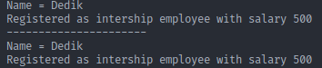
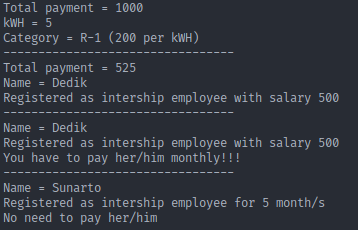
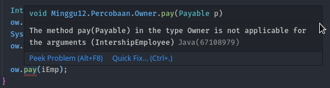

# LAPORAN PERCOBAAN PRAKTIKUM PBO || MINGGU 12

## PERCOBAAN 1

> Pertanyaan

1. Class apa sajakah yang merupakan turunan dari class Employee?

   **Jawab:** class InteshipEmployee dan PermanentEmployee

2. Class apa sajakah yang implements ke interface Payable?

   **Jawab:** class PermanentEmployee dan ElectricityBill

3. Perhatikan class Tester1, baris ke-10 dan 11. Mengapa e, bisa diisi dengan objek pEmp (merupakan objek dari class PermanentEmployee) dan objek iEmp (merupakan objek dari class InternshipEmploye) ?

   **Jawab:** Karena objek pEmp dan iEmp adalah turunan atau subclass dari class Employee (e)

4. Perhatikan class Tester1, baris ke-12 dan 13. Mengapa p, bisa diisi dengan objek pEmp (merupakan objek dari class PermanentEmployee) dan objek eBill (merupakan objek dari class ElectricityBill) ?

   **Jawab:** Karena objek pEmp dan eBill berada dalam satu interface yaitu inteface Payable

5. Coba tambahkan sintaks:

- p = iEmp;

- e = eBill;

  pada baris 14 dan 15 (baris terakhir dalam method main) ! Apa yang menyebabkan error?

  **Jawab:**

  - p = iEmp;

    Error dikarenakan objek iEmp tidak berelasi atau tidak mempunyi iterface dari Payable.

  - e = eBill;

    Error dikarenakan objek eBill bukan termasuk class turunan dari Employee.

6. Ambil kesimpulan tentang konsep/bentuk dasar polimorfisme!

   **Jawab:**

## PERCOBAAN 2

1. Pada percobaan ini masih akan digunakan class-class dan interface yang digunakan pada percobaan sebelumnya.

2. Buat class baru dengan nama Tester2.

   **Jawab:**

```
package Minggu12.Percobaan;

public class Tester2 {
  public static void main(String[] args) {
    PermanentEmployee pEmp = new PermanentEmployee("Dedik", 500);
    Employee e;
    e = pEmp;
    System.out.println("" + e.getEmployeeInfo());
    System.out.println("----------------------");
    System.out.println("" + pEmp.getEmployeeInfo());
  }
}
```

3. Jalankan class Tester2, dan akan didapatkan hasil sebagai berikut:

   **Jawab:** Polimorfisme dalam OOP adalah sebuah prinsip di mana class dapat memiliki banyak “bentuk” method yang berbeda-beda meskipun namanya sama. “Bentuk” di sini dapat kita artikan: isinya berbeda, parameternya berbeda, dan tipe datanya berbeda.



> Pertanyaan

1. Perhatikan class Tester2 di atas, mengapa pemanggilan e.getEmployeeInfo() pada baris 8 dan pEmp.getEmployeeInfo() pada baris 10 menghasilkan hasil sama?

   **Jawab:** dikarenakan pada pemanggilan e.getEmployeeInfo() tersebut memanggil atau merujuk ke objek pEmp, maka dari itu dapat memanggil method yang ada di objek pEmp;

2. Mengapa pemanggilan method e.getEmployeeInfo() disebut sebagai pemanggilan method virtual (virtual method invication), sedangkan pEmp.getEmployeeInfo() tidak?

   **Jawab:** Dikarenakan pada method e.getEmployeeInfo() tersebut merujuk ke objek pEmp; sedangkan method pEmp.getEmployeeInfo() itu sudah termasuk didalam objek itu sendiri.

3. Jadi apakah yang dimaksud dari virtual method invocation? Mengapa disebut virtual?

   **Jawab:** Pada saat obyek yang sudah dibuat tersebut memanggil overridden method pada parent class, kompiler Java akan melakukan invocation (pemanggilan) terhadap overriding method pada subclass, dimana yang seharusnya dipanggil adalah overridden.

## PERCOBAAN 3

> Langkah-langkah

1. Pada percobaan ke-3 ini, masih akan digunakan class-class dan interface pada percobaan sebelumnya.
2. Buat class baru Tester3.

   **Jawab**:

   ```
   package Minggu12.Percobaan;

   public class Tester3 {
    public static void main(String[] args) {
      PermanentEmployee pEmp = new PermanentEmployee("Dedik", 500);
      IntershipEmployee iEmp = new IntershipEmployee("Sunarto", 5);
      ElectricityBill eBill = new ElectricityBill(5, "A-1");
      Employee e[] = { pEmp, iEmp };
      Payable p[] = { pEmp, eBill };
      Employee e2[] = { pEmp, iEmp, eBill };
    }
   }
   ```

> Pertanyaan

1. Perhatikan array e pada baris ke-8, mengapa ia bisa diisi dengan objek objek dengan tipe yang berbeda, yaitu objek pEmp (objek dari PermanentEmployee) dan objek iEmp (objek dari InternshipEmployee) ?

   **Jawab:** Dikarenakan isi dari array e tersebut adalah subclass atau class turunan dari class Employee.

2. Perhatikan juga baris ke-9, mengapa array p juga biisi dengan objek-objek dengan tipe yang berbeda, yaitu objek pEmp (objek dari PermanentEmployee) dan objek eBill (objek dari ElectricityBilling) ?

   **Jawab:** Dikarenakan isi dari array p tersebut adalah implements dari class interface Payable.

3. Perhatikan baris ke-10, mengapa terjadi error?

   **Jawab:** Terjadi error dalam pengisian array dikarenakan untuk array Employee hanya bisa diisi dengan objek dari class itu sendiri ataupun class turunannya. Jadi selain dari itu objek tidak bisa dimasukkan pada array Employee;

## PERCOBAAN 4

> Langkah-langkah

1. Percobaan 4 ini juga masih menggunakan class-class dan interface yang digunakan pada percobaan sebelumnya.

2. Buat class baru dengan nama Owner. Owner bisa melakukan pembayaran baik kepada pegawai permanen maupun rekening listrik melalui method pay(). Selain itu juga bisa menampilkan info pegawai permanen maupun pegawai magang melalui method showMyEmployee().

   **Jawab:**

   ```
   package Minggu12.Percobaan;
   public class Owner {
    public void pay(Payable p) {
      System.out.println("Total payment = " + p.getPaymentAmount());
      if (p instanceof ElectricityBill) {
        ElectricityBill eb = (ElectricityBill) p;
        System.out.println("" + eb.getBillInfo());
      } else if (p instanceof PermanentEmployee) {
        PermanentEmployee pe = (PermanentEmployee) p;
        pe.getEmployeeInfo();
        System.out.println("" + pe.getEmployeeInfo());
      }
    }

    public void showMyEmployee(Employee e) {
      System.out.println("" + e.getEmployeeInfo());
      if (e instanceof PermanentEmployee) {
        System.out.println("You have to pay her/him monthly!!!");
      } else {
        System.out.println("No need to pay her/him");
      }
    }
   }
   ```

3. Buat class baru Tester4.

   **Jawab:**

```
package Minggu12.Percobaan;

public class Tester4 {
  public static void main(String[] args) {
    Owner ow = new Owner();
    ElectricityBill eBill = new ElectricityBill(5, "R-2");
    ow.pay(eBill);
    System.out.println("---------------------------------");

    PermanentEmployee pEmp = new PermanentEmployee("Dedik", 500);
    ow.pay(pEmp);
    System.out.println("---------------------------------");

    IntershipEmployee iEmp = new IntershipEmployee("Sunarto", 5);
    ow.showMyEmployee(pEmp);
    System.out.println("---------------------------------");
    ow.showMyEmployee((iEmp));
  }
}
```

4. Jalankan class Teaser4

   **Jawab:**

   

> Pertanyaan

1. Perhatikan class Tester4 baris ke-7 dan baris ke-11, mengapa pemanggilan ow.pay(eBill) dan ow.pay(pEmp) bisa dilakukan, padahal jika diperhatikan method pay() yang ada di dalam class Owner memiliki argument/parameter bertipe Payable? Jika diperhatikan lebih detil eBill merupakan objek dari ElectricityBill dan pEmp merupakan objek dari PermanentEmployee?

   **Jawab:** Dikarenakan untuk argument pEmp adalah sebuah objek dari class PermanentEmployee yang mengimplements class interface Payable.

2. Jadi apakah tujuan membuat argument bertipe Payable pada method pay() yang ada di dalam class Owner?

   **Jawab:** Tujuan dari pembuatan argument bertipe Payable pada method pay() yang ada didalam class Owner dikarenakan untuk menyederhanakan pemanggilan method pada suatu sublass atau class turunan

3. Coba pada baris terakhir method main() yang ada di dalam class Tester4 ditambahkan perintah ow.pay(iEmp);



Mengapa terjadi error?

**Jawab:** Terjadi error dikarenakan argument yang dimasukkan tidak sesuai dengan yang dideklarasikan. Objek iEmp adalah bukan termasuk dari implements dari class interface Payable

4. Perhatikan class Owner, diperlukan untuk apakah sintaks p instanceof ElectricityBill pada baris ke-6 ?

   **Jawab:** Diperlukan untuk mengecek argument p apakah sebuah instansiasi objek dari class ElectricityBill

5. Perhatikan kembali class Owner baris ke-7, untuk apakah casting objek disana (ElectricityBill eb = (ElectricityBill) p) diperlukan ? Mengapa objek p yang bertipe Payable harus di-casting ke dalam objek eb yang bertipe ElectricityBill ?

   **Jawab:** Dikarenakan menyesuaikan dari argument serta objek yang dibuat pada masing-masing class yang terhubung dengan interface Payable.
