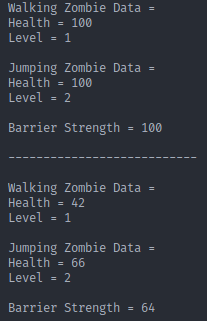

# LAPORAN TUGAS PRAKTIKUM PERTEMUAN 12

### SOURCE CODE

> Class Zombie

```
package Tugas;

public class Zombie implements Destroyable {
  protected int health, level;

  public void heal() {

  }

  @Override
  public void destroyed() {

  }

  public String getZombieInfo() {
    String info = "Health = " + this.health;
    info += "\nLevel = " + this.level + "\n";
    return info;
  }

}
```

> Class Destroyable

```
package Tugas;

public interface Destroyable {
  public void destroyed();
}
```

> Class JumpingZombie

```
package Tugas;

public class JumpingZombie extends Zombie {

  public JumpingZombie(int health, int level) {
    this.health = health;
    this.level = level;
  }

  @Override
  public void heal() {
    switch (this.level) {
      case 1:
        this.health += (30 / 100 * this.health);
        break;
      case 2:
        this.health += (40 / 100 * this.health);
        break;
      case 3:
        this.health += (50 / 100 * this.health);
        break;
    }
  }

  @Override
  public void destroyed() {
    this.health -= (10 * this.health / 100);
  }

  @Override
  public String getZombieInfo() {
    String info = "Jumping Zombie Data = \n";
    info += super.getZombieInfo();
    return info;
  }
}
```

> Class WalkingZombie

```
package Tugas;

public class WalkingZombie extends Zombie {

  public WalkingZombie(int health, int level) {
    this.health = health;
    this.level = level;
  }

  @Override
  public void heal() {
    switch (this.level) {
      case 1:
        this.health += (20 / 100 * this.health);
        break;
      case 2:
        this.health += (30 / 100 * this.health);
        break;
      case 3:
        this.health += (40 / 100 * this.health);
        break;
    }
  }

  @Override
  public void destroyed() {
    this.health -= (20 * this.health / 100);
  }

  @Override
  public String getZombieInfo() {
    String info = "Walking Zombie Data = \n";
    info += super.getZombieInfo();
    return info;
  }
}
```

> Class Barrier

```
package Tugas;

public class Barrier implements Destroyable {
  private int strength;

  public Barrier(int strength) {
    this.strength = strength;
  }

  public int getStrength() {
    return strength;
  }

  public void setStrength(int strength) {
    this.strength = strength;
  }

  @Override
  public void destroyed() {
    this.strength -= (0.1 * this.strength);
  }

  public String getBarrierInfo() {
    String info = "Barrier Strength = " + this.getStrength();
    return info;
  }

}
```

> Class Plant

```
package Tugas;

public class Plant {
  public void doDestroy(Destroyable d) {
    if (d instanceof JumpingZombie) {
      JumpingZombie jz = (JumpingZombie) d;
      jz.heal();
      jz.destroyed();
    } else if (d instanceof WalkingZombie) {
      WalkingZombie wz = (WalkingZombie) d;
      wz.heal();
      wz.destroyed();
    } else {
      Barrier b = (Barrier) d;
      b.destroyed();
    }
  }
}
```

> Class Tester

```
package Tugas;

public class Tester {
  public static void main(String[] args) {
    WalkingZombie wz = new WalkingZombie(100, 1);
    JumpingZombie jz = new JumpingZombie(100, 2);
    Barrier b = new Barrier(100);
    Plant p = new Plant();

    System.out.println("" + wz.getZombieInfo());
    System.out.println("" + jz.getZombieInfo());
    System.out.println("" + b.getBarrierInfo());

    System.out.println("\n---------------------------\n");

    for (int i = 0; i < 4; i++) {
      p.doDestroy(wz);
      p.doDestroy(jz);
      p.doDestroy(b);
    }

    System.out.println("" + wz.getZombieInfo());
    System.out.println("" + jz.getZombieInfo());
    System.out.println("" + b.getBarrierInfo());
  }
}
```

### OUTPUT PROGRAM


