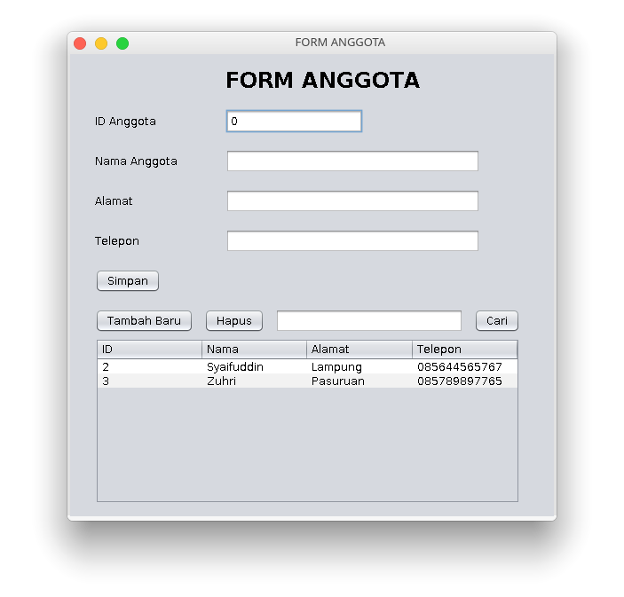

# LAPORAN

## Class Kategori

- Test class Kategori

  

- Menampilkan data kategori melalui GUI

  

- Menambahkan data baru

- Menampilkan selected data kategori

- Menghapus salah satu data kategori

- Mencari salah satu data kategori

## Class Buku

- Test class buku

  

- Menampilkan data buku melalui GUI

  

- Menambahkan data baru

- Mencari salah satu data buku

- Menghapus salah satu data buku

## Class Anggota

- Test class anggota

  

- Menampilkan data anggota melalui GUI

  

- Menambahkan data baru

- Menampilkan selected data anggota

- Menghapus salah satu data anggota

- Mencari salah satu data anggota

## Class Peminjaman

- Test class Peminjaman

- Menampilkan data peminjaman melalui GUI

  

- Menambahkan data baru

- Tampilan jika ID tidak ditemukan

- Menampilkan selected data peminjaman

- Menghapus salah satu data peminjaman

