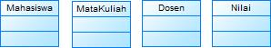
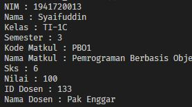
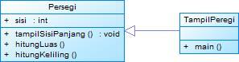
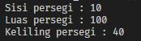

# LAPORAN TEORI | PERTEMUAN 2

## LATIHAN 1

> Class Diagram



Dalam implementasi terdapat 4 class diantaranya Mahasiswa, MataKuliah, Dosen, dan Nilai.

## LATIHAN 2

> Class Diagram

Manambahkan atribut kepada masing-masing class yang sudah dibuat sebelumnya


## Source Code Program Penilaian Mahasiswa

> Class Mahasiswa

```
public class Mahasiswa {
   private int nim;
   private String namaMhs;
   private String kelas;
   private int semester;

   public int setNim(int newValue) {
      nim = newValue;
      return nim;
   }

   public String setNamaMhs(String newValue) {
      namaMhs = newValue;
      return namaMhs;
   }

   public String setKelas(String newValue) {
      kelas = newValue;
      return kelas;
   }

   public int setSemester(int newValue) {
      semester = newValue;
      return semester;
   }

   public void infoMhs() {
      System.out.println("NIM : " + nim);
      System.out.println("Nama : " + namaMhs);
      System.out.println("Kelas : " + kelas);
      System.out.println("Semester : " + semester);
   }
}
```

> Class MataKuliah

```
public class MataKuliah {
   private String kodeMatkul;
   private String namaMatkul;
   private int sks;

   public String setKodeMatkul(String newValue) {
      kodeMatkul = newValue;
      return kodeMatkul;
   }

   public String setMatkul(String newValue) {
      namaMatkul = newValue;
      return namaMatkul;
   }

   public int setSks(int newValue) {
      sks = newValue;
      return sks;
   }

   public int tambahSks(int inc) {
      sks += inc;
      return sks;
   }

   public int kurangiSks(int dec) {
      sks -= dec;
      return sks;
   }

   public void infoMatkul() {
      System.out.println("Kode Matkul : " + kodeMatkul);
      System.out.println("Nama Matkul : " + namaMatkul);
      System.out.println("Sks : " + sks);
   }
}
```

> Class Nilai

```
public class Nilai {
   private int nilai;

   public int setNilai(int newValue) {
      nilai = newValue;
      return nilai;
   }

   public int tambahNilai(int inc) {
      nilai += inc;
      return nilai;
   }

   public int kurangiNilai(int dec) {
      nilai -= dec;
      return nilai;
   }

   public void infoNilai() {
      System.out.println("Nilai : " + nilai);
   }
}
```

> Class Dosen

```
public class Dosen {
   private int idDosen;
   private String namaDosen;

   public String setNama(String newValue) {
      namaDosen = newValue;
      return namaDosen;
   }

   public int setIdDosen(int newValue) {
      idDosen = newValue;
      return idDosen;
   }

   public void infoDosen() {
      System.out.println("ID Dosen : " + idDosen);
      System.out.println("Nama Dosen : " + namaDosen);
   }

   public static void main(String[] args) {
      Dosen dsn1 = new Dosen();
      Nilai nil1 = new Nilai();
      Mahasiswa mhs1 = new Mahasiswa();
      MataKuliah mk1 = new MataKuliah();

      mhs1.setNim(1941720013);
      mhs1.setNamaMhs("Syaifuddin");
      mhs1.setKelas("TI-1C");
      mhs1.setSemester(3);

      mk1.setKodeMatkul("PBO1");
      mk1.setMatkul("Pemrograman Berbasis Objek");
      mk1.setSks(6);

      nil1.setNilai(100);

      dsn1.setIdDosen(133);
      dsn1.setNama("Pak Enggar");

      mhs1.infoMhs();
      mk1.infoMatkul();
      nil1.infoNilai();
      dsn1.infoDosen();
   }
}
```

> Output Program



## LATIHAN 3

> Class Diagram



> Source Code

> Class Persegi

```
public class Persegi {
   public int sisi;

   public void tampilSisiPanjang() {
      System.out.println("Sisi persegi : " + sisi);
   }

   public int hitungLuas() {
      return sisi * sisi;
   }

   public int hitungKeliling() {
      return 4 * sisi;
   }
}
```

> Class TampilPersegi

```
public class TampilPersegi extends Persegi {
   public static void main(String[] args) {
      Persegi p1 = new Persegi();
      p1.sisi = 10;
      p1.tampilSisiPanjang();
      System.out.println("Luas persegi : " + p1.hitungLuas());
      System.out.println("Keliling persegi : " + p1.hitungKeliling());
   }
}
```

> Output Program


