# TUGAS PRAKTIKUM | PERTEMUAN 2

## NOMOR 1

### Membuat Class Diagram Peminjaman

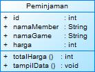

## NOMOR 2

### Membuat program dari class diagram yang dibuat dari nomor 1

> Source Code

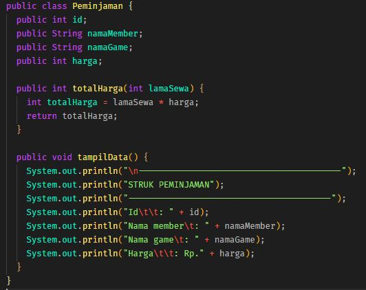

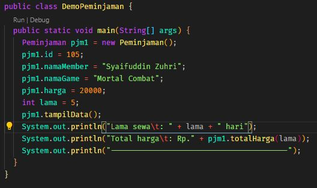

> Output

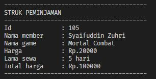

## NOMOR 3

### Membuat program dari class diagram lingkaran

> Class diagram

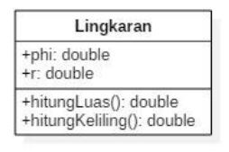

> Source Code

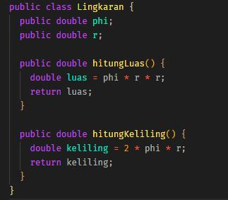

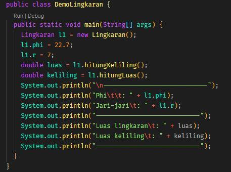

> Output

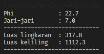

## NOMOR 4

### Membuat program dari class diagram barang

> Class Diagram

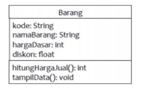

> Program Code

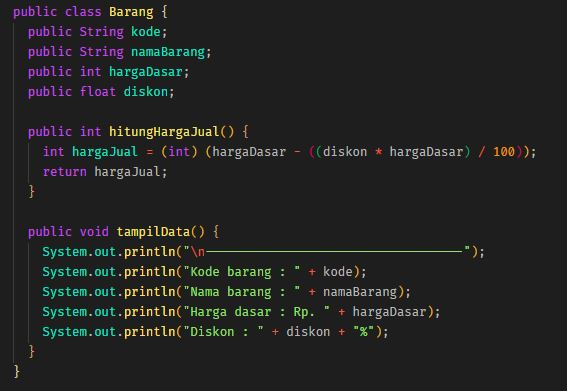

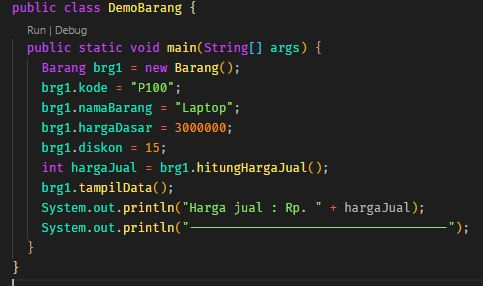

> Output

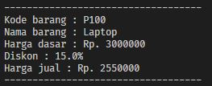
