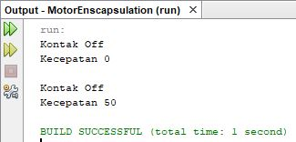

# SCREENSHOOT OUTPUT PROGRAM

## Percobaan 1

## Percobaan 2

> Pertanyaan 1

1. Pada class TestMobil, saat kita menambah kecepatan untuk pertama kalinya, mengapa muncul peringatan “Kecepatan tidak bisa bertambah karena Mesin Off!”?

   Jawab : Karena mesin dalam kondisi off, maka kecepatan tidak bisa ditambahkan.

2. Mengapat atribut kecepatan dan kontakOn diset private?

   Jawab : Agar dalam mengatur ulang atau mengambil data itu harus perlu akses method yang ada didalam class tersebut tanpa menyentuh langsung atributnya.

3. Ubah class Motor sehingga kecepatan maksimalnya adalah 100!

   Jawab :

## Percobaan 3

## Percobaan 4

> Pertanyaan 2

1. Apa yang dimaksud getter dan setter?

   Jawab : Getter adalah public method dan memiliki tipe data return, yang berfungsi untuk mendapatkan nilai dari atribut private. Sedangkan setter adalah public method yang tidak memliki tipe data return,yang berfungsi untuk memanipulasi nilai dari atribut private.

2. Apa kegunaan dari method getSimpanan()?

   Jawab : untuk mendapatkan nilai simpanan yang sudah dijadikan variable

3. Method apa yang digunakan untk menambah saldo?

   Jawab : method setor

4. Apa yand dimaksud konstruktor?

   Jawab : Konstruktor mirip dengan method cara deklarasinya akan tetapi tidak memiliki tipe return. Dan konsturktor dieksekusi ketika instan dari objek dibuat. Jadi setiap kali sebuat objek dibuat dengan keyword new() maka konstruktor akan dieksekusi.

5. Sebutkan aturan dalam membuat konstruktor?

   Jawab :
   Cara untuk membuat konstruktor adalah sebagai berikut:

   a. Nama konstruktor harus sama dengan nama class

   b. Konstruktor tidak memiliki tipe data return

   c. Konstruktor tidak boleh menggunakan modifier abstract, static, final, dan syncronized

6. Apakah boleh konstruktor bertipe private?

   Jawab : boleh

7. Kapan menggunakan parameter dengan passsing parameter?

   Jawab : Digunakan jika tidak perlu method setter getter

8. Apa perbedaan atribut class dan instansiasi atribut?

   Jawab : atribut class adalah atribut yang digunakan dalam class tersebut, sedangkan instansiasi atribut adalah atribut yang digunakan dalam class lain melalui instansiasi class tersebut.

9. Apa perbedaan class method dan instansiasi method?
   Jawab : method class adalah method yang digunakan dalam class tersebut, sedangkan instansiasi method adalah method yang digunakan dalam class lain melalui instansiasi class tersebut.
