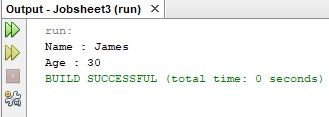
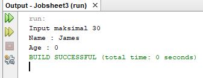
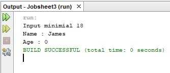
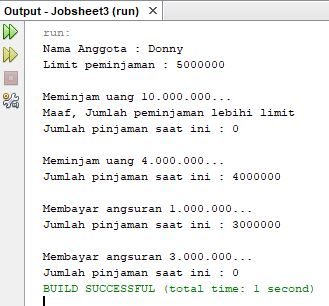
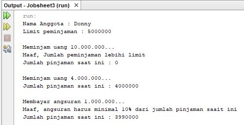
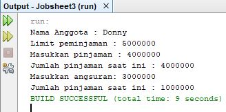

# OUTPUT PROGRAM

# Nomor 1



# Nomor 2

Age pada output program bernilai 30 padahal diinputkan 35, itu terjadi karena ada pengondisian method dalam class mengenai maksimal mengatur nilai age yaitu maksimal 30.

# Nomor 3

```
if(age >= 30){
  System.out.println("Input maksimal 30");
} else if (age <= 18){
    System.out.println("Input minimial 18");
} else {
    this.age = age;
}
```





# Nomor 4



# Nomor 5



# Nomor 6


