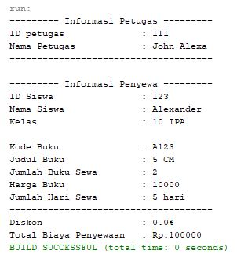
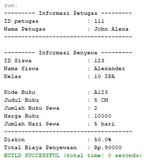

# LAPORAN TUGAS PRAKTIKUM || PERTEMUAN 4

## Class Diagram Studi Kasus


### Terdapat 4 class pada studi kasus ini diantaranya :

1. Siswa
2. Buku
3. Petugas
4. Penyewa

### Kode Program

> _class_ Siswa

```
package TugasPertemuan4.PenyewaanBuku;

public class Siswa {
    private int idSiswa;
    private String nama, kelas;

    public Siswa() {
    }

    public Siswa(int idSiswa, String nama, String kelas) {
        this.idSiswa = idSiswa;
        this.nama = nama;
        this.kelas = kelas;
    }

    public int getIdSiswa() {
        return idSiswa;
    }

    public void setIdSiswa(int idSiswa) {
        this.idSiswa = idSiswa;
    }

    public String getNama() {
        return nama;
    }

    public void setNama(String nama) {
        this.nama = nama;
    }

    public String getKelas() {
        return kelas;
    }

    public void setKelas(String kelas) {
        this.kelas = kelas;
    }

    public void info(){
        System.out.println("ID Siswa\t\t: " + this.idSiswa);
        System.out.println("Nama Siswa\t\t: " + this.nama);
        System.out.println("Kelas\t\t\t: " + this.kelas);
    }
}

```

> _class_ Buku

```
package TugasPertemuan4.PenyewaanBuku;

public class Buku {
    private String kode, judul;
    private int jumlah, harga;

    public Buku() {
    }

    public Buku(String kode, String judul, int jumlah, int harga) {
        this.kode = kode;
        this.judul = judul;
        this.jumlah = jumlah;
        this.harga = harga;
    }

    public String getKode() {
        return kode;
    }

    public void setKode(String kode) {
        this.kode = kode;
    }

    public String getJudul() {
        return judul;
    }

    public void setJudul(String judul) {
        this.judul = judul;
    }

    public int getJumlah() {
        return jumlah;
    }

    public void setJumlah(int jumlah) {
        this.jumlah = jumlah;
    }

    public int getHarga() {
        return harga;
    }

    public void setHarga(int harga) {
        this.harga = harga;
    }

    public void info(){
        System.out.println("Kode Buku\t\t: " + this.kode);
        System.out.println("Judul Buku\t\t: " + this.judul);
        System.out.println("Jumlah Buku Sewa\t: " + this.jumlah);
        System.out.println("Harga Buku\t\t: " + this.harga);
    }
}

```

> _class_ Petugas

```
package TugasPertemuan4.PenyewaanBuku;

public class Petugas {
    private int idPetugas;
    private String nama;

    public Petugas() {
    }

    public Petugas(int idPetugas, String nama) {
        this.idPetugas = idPetugas;
        this.nama = nama;
    }

    public int getIdPetugas() {
        return idPetugas;
    }

    public void setIdPetugas(int idPetugas) {
        this.idPetugas = idPetugas;
    }

    public String getNama() {
        return nama;
    }

    public void setNama(String nama) {
        this.nama = nama;
    }

    public void info(){
        System.out.println("ID petugas\t\t: " + this.idPetugas);
        System.out.println("Nama Petugas\t\t: " + this.nama);
    }
}

```

> _class_ Penyewa

```
package TugasPertemuan4.PenyewaanBuku;

public class Penyewa {
    private Siswa siswa;
    private Buku buku;
    private Petugas petugas;
    private int hari;
    private float diskon;

    public Penyewa() {
    }

    public Penyewa(Siswa siswa, Buku buku, Petugas petugas) {
        this.siswa = siswa;
        this.buku = buku;
        this.petugas = petugas;
    }

    public Siswa getSiswa() {
        return siswa;
    }

    public void setSiswa(Siswa siswa) {
        this.siswa = siswa;
    }

    public Buku getBuku() {
        return buku;
    }

    public void setBuku(Buku buku) {
        this.buku = buku;
    }

    public Petugas getPetugas() {
        return petugas;
    }

    public void setPetugas(Petugas petugas) {
        this.petugas = petugas;
    }

    public int getHari() {
        return hari;
    }

    public void setHari(int hari) {
        this.hari = hari;
    }

    public float getDiskon() {
        return diskon;
    }

    public void setDiskon(float diskon) {
        this.diskon = diskon;
    }

    public int hitungTotalBiaya(){
        int total = 0;
        if(this.diskon == 0.0){
            total = buku.getHarga() * this.hari * buku.getJumlah();
        } else {
            int hargaDiskon = (int)((this.diskon * buku.getHarga() * buku.getJumlah()) / 100);
            total = (buku.getHarga() * this.hari * buku.getJumlah()) - hargaDiskon;
        }
        return total;
    }

    public void info(){
        System.out.println("--------- Informasi Petugas ---------");
        this.petugas.info();
        System.out.println("-------------------------------------\n");
        System.out.println("--------- Informasi Penyewa ---------");
        this.siswa.info();
        System.out.println("");
        if(this.buku.getJumlah() > 0 ){
            this.buku.info();
            System.out.println("Jumlah Hari Sewa\t: " + this.hari + " hari");
        } else {
            System.out.println("Jumlah buku sewa tidak boleh kosong");
        }
            System.out.println("-------------------------------------");

    }
}

```

> _class_ Main

```
package TugasPertemuan4.PenyewaanBuku;

public class Main {
    public static void main(String[] args) {
        Siswa siswa = new Siswa();
        siswa.setIdSiswa(123);
        siswa.setNama("Alexander");
        siswa.setKelas("10 IPA");

        Buku buku = new Buku();
        buku.setKode("A123");
        buku.setJudul("5 CM");
        buku.setJumlah(2);
        buku.setHarga(10000);

        Petugas petugas = new Petugas(111, "John Alexa");

        Penyewa penyewa = new Penyewa(siswa, buku, petugas);
        penyewa.setHari(5);
        penyewa.info();
        penyewa.setDiskon(50);
        System.out.println("Diskon\t\t\t: " + penyewa.getDiskon() + "%");
        System.out.println("Total Biaya Penyewaan\t: Rp." + penyewa.hitungTotalBiaya());
    }
}
```

### Output Program

> Jika program tidak menggunakan atribut diskon



> Jika program menggunakan atribut diskon


