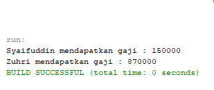

# LAPORAN PRAKTIKUM PBO | PERTEMUAN 6

## SOURCE CODE

> Class Dosen

```
package Praktikum;

/**
 *
 * @author Master
 */
public class Dosen extends Pegawai{
    public int jumlahSKS;
    public int TARIF_SKS;

    public Dosen(String nip, String nama, String alamat) {
        super(nip, nama, alamat);
        this.TARIF_SKS = 120000;
    }

    public void setSKS(int sks){
        this.jumlahSKS = sks;
    }

    public int getGaji(){
        return (this.jumlahSKS * this.TARIF_SKS) + super.getGaji();
    }
}
```

> CLass Pegawai

```
package Praktikum;

/**
 *
 * @author Master
 */
public class Pegawai {
    public String nip, nama, alamat;

    public Pegawai(String nip, String nama, String alamat) {
        this.nip = nip;
        this.nama = nama;
        this.alamat = alamat;
    }

    public String getNama() {
        return this.nama;
    }

    public int getGaji(){
        return 150000;
    }
}
```

> Class DaftarGaji

```
package Praktikum;

/**
 *
 * @author Master
 */
public class DaftarGaji {
    public Pegawai[] listPegawai;
    private int jumlahPegawai = 0;


    public DaftarGaji(int n) {
        listPegawai = new Pegawai[n];
    }

    public void addPegawai(Pegawai pegawai){
        listPegawai[jumlahPegawai] = pegawai;
        jumlahPegawai++;
    }

    public void printSemuaGaji(){
        for (int i = 0; i < jumlahPegawai; i++) {
            String nama = listPegawai[i].getNama();
            int gaji = listPegawai[i].getGaji();
            System.out.println(nama + " mendapatkan gaji : " + gaji);
        }
    }
}
```

> Class Main

```
package Praktikum;

/**
 *
 * @author Master
 */
public class Main {
    public static void main(String[] args) {
        Pegawai pegawai = new Pegawai("12345", "Syaifuddin", "Pasuruan");

        Dosen dosen = new Dosen("18123", "Zuhri", "Malang");
        dosen.setSKS(6);

        DaftarGaji daftarGaji = new DaftarGaji(2);
        daftarGaji.addPegawai(pegawai);
        daftarGaji.addPegawai(dosen);

        daftarGaji.printSemuaGaji();
    }
}
```

## OUTPUT PROGRAM


