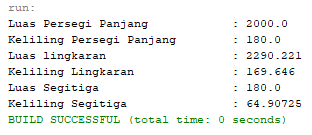

# LAPORAN TUGAS TEORI | PERTEMUAN 6

## Source Code

> Class Bangun Datar

```
package Teori;

/**
 *
 * @author Master
 */
public class BangunDatar {

    public float luas(){
        return 0;
    }

    public float keliling(){
        return 0;
    }
}

```

> Class Segitiga

```
package Teori;
import static java.lang.Math.sqrt;

/**
 *
 * @author Master
 */
public class Segitiga extends BangunDatar{

    public float alas;
    public float tinggi;

    @Override
    public float luas(){
        float luas = (alas * tinggi) / 2;
        System.out.println("Luas Segitiga\t\t\t: " + luas);
        return luas;
    }

    @Override
    public float keliling(){
        float m = (float) sqrt((alas*alas)+(tinggi*tinggi));
        float keliling = m + alas + tinggi;
        System.out.println("Keliling Segitiga\t\t: " + keliling);
        return keliling;
    }
}
```

> Class Persegi Panjang

```
package Teori;

/**
 *
 * @author Master
 */
public class PersegiPanjang extends BangunDatar {

    public float lebar;
    public float panjang;

    @Override
    public float luas(){
        float luas = panjang * lebar;
        System.out.println("Luas Persegi Panjang\t\t: " + luas);
        return luas;
    }

    @Override
    public float keliling(){
        float kll = 2*panjang + 2*lebar;
        System.out.println("Keliling Persegi Panjang\t: " + kll);
        return kll;
    }
}
```

> Class Lingkaran

```
package Teori;

/**
 *
 * @author Master
 */
public class Lingkaran extends BangunDatar {

    public float r;

    @Override
    public float luas(){
        float luas = (float) (Math.PI * r * r);
        System.out.println("Luas lingkaran\t\t\t: " + luas);
        return luas;
    }

    @Override
    public float keliling(){
        float keliling = (float) (2 * Math.PI * r);
        System.out.println("Keliling Lingkaran\t\t: " + keliling);
        return keliling;
    }
}
```

> Class Main

```
package Teori;

/**
 *
 * @author Master
 */
public class Main {
    public static void main(String[] args) {
        PersegiPanjang persegiPanjang = new PersegiPanjang();
        Lingkaran lingkaran = new Lingkaran();
        Segitiga segitiga = new Segitiga();

        // Persegi Panjang
        persegiPanjang.lebar = 50;
        persegiPanjang.panjang = 40;
        persegiPanjang.luas();
        persegiPanjang.keliling();

        // Lingkaran
        lingkaran.r = 27;
        lingkaran.luas();
        lingkaran.keliling();

        // Segitiga
        segitiga.alas = 18;
        segitiga.tinggi = 20;
        segitiga.luas();
        segitiga.keliling();
    }
}
```

## OUTPUT PROGRAM


