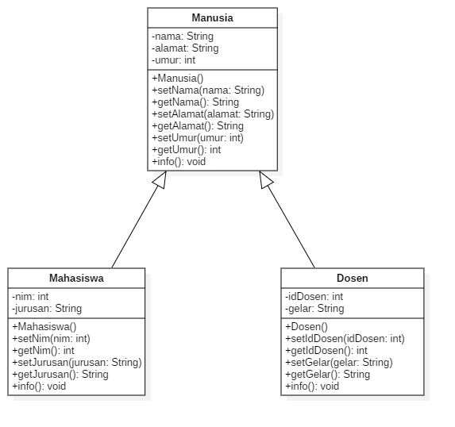
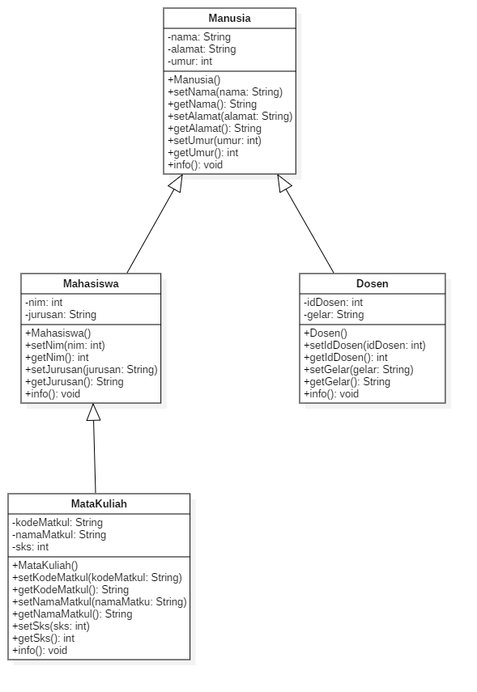

# LAPORAN LATIHAN SOAL TEORI | PERTEMUAN 7

## STUDI KASUS HIERARCHICAL INHERITANCA

Terdapat 3 class diantaranya Manusia, Mahasiswa, dan Dosen. Class Manusia mewarisi 2 class yaitu class Mahasiswa dan class Dosen.

## STUDI KASUS HYBRID INHERITANCE

Terdapat 4 class diantaranya Manusia, Mahasiswa, Dosen, dan MataKuliah. Class Manusia mewarisi 2 class yaitu class Mahasiswa dan class Dosen. Kemudian class Mahasiswa mewarisi lagi ke class MataKuliah

