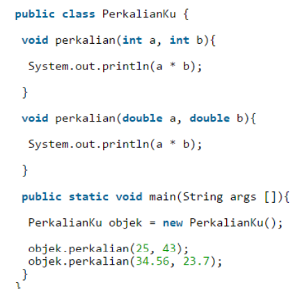
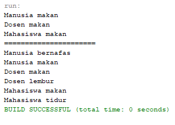

# LAPORAN PRAKTIKUM PBO || PERTEMUAN 9

## PERCOBAAN

### Percobaan 1

> Output Program


### Latihan


1. Dari source coding diatas terletak dimanakah overloading?

   Jawab : Overloading terletak pada method perkalian dengan jumlah parameter yang berbeda.

2. Jika terdapat overloading ada berapa jumlah parameter yang berbeda?

   Jawab : Pada method pertama berparameter 2 sedangkan method kedua berparameter 3

<br>



1. Dari source coding diatas terletak dimanakah overloading?

   Jawab : Overloading terletak pada method perkalian dengan tipe parameter yang berbeda.

2. Jika terdapat overloading ada berapa tipe parameter yang berbeda?

   Jawab : Pada method pertama parameter bertipe int sedangkan method kedua parameter bertipe double

<br>


1. Dari source coding diatas terletak dimanakah overriding?

   Jawab : Overriding terletak pada method swim didalam class Piranha. Dimana method tersebut sama dengan method yang ada pada parent class nya yaitu Ikan.

2. Jabarkanlah apabila sourcoding diatas jika terdapat overriding?

   Jawab : Pada method swim didalam class Piranha mempunyai modifier dan tipe method yang sama dengan method swim yang ada didalam class Ikan, maka dari itu dinamakan overriding.

## TUGAS

### Nomor 1

> Code Program

```
package Tugas;

/**
 *
 * @author Master
 */
public class Segitiga {
    private int sudut;

    public int totalSudut(int sudutA){
        return this.sudut = 180 - sudutA;
    }

    public int totalSudut(int sudutA, int sudutB){
        return this.sudut = 180 - (sudutA + sudutB);
    }

    public int keliling(int sisiA, int sisiB, int sisiC){
        return sisiA * sisiB * sisiC;
    }

    public double keliling(int sisiA, int sisiB){
        return Math.sqrt(Math.pow(sisiA, 2)) + Math.sqrt(Math.pow(sisiB, 2));
    }

    public static void main(String[] args) {
        Segitiga segitiga = new Segitiga();
        System.out.println("Total Sudut dengan 1 parameter : " + segitiga.totalSudut(15));
        System.out.println("Total Sudut dengan 2 parameter : " + segitiga.totalSudut(15, 20));
        System.out.println("Keliling dengan 2 parameter : " + segitiga.keliling(10, 12));
        System.out.println("Keliling dengan 3 parameter : " + segitiga.keliling(4, 5, 6));
    }
}
```

> Output Program


### Nomor 2

## Code Program

> Class Manusia

```
package Tugas;

/**
 *
 * @author Master
 */
public class Manusia {
    public void bernafas(){
        System.out.println("Manusia bernafas");
    }

    public void makan(){
        System.out.println("Manusia makan");
    }
}
```

> Class Dosen

```
package Tugas;

/**
 *
 * @author Master
 */
public class Dosen extends Manusia{
    public void makan(){
        System.out.println("Dosen makan");
    }

    public void lembur(){
        System.out.println("Dosen lembur");
    }
}
```

> Class Mahasiswa

```
package Tugas;

/**
 *
 * @author Master
 */
public class Mahasiswa extends Manusia{
    public void makan(){
        System.out.println("Mahasiswa makan");
    }

    public void tidur(){
        System.out.println("Mahasiswa tidur");
    }
}
```

> Class DemoManusia

```
/*
 * To change this license header, choose License Headers in Project Properties.
 * To change this template file, choose Tools | Templates
 * and open the template in the editor.
 */
package Tugas;

/**
 *
 * @author Master
 */
public class DemoManusia {
    public static void main(String[] args) {
        // Method dynamic dispatch
        Manusia manusia;

        manusia = new Manusia();
        manusia.makan();

        manusia = new Dosen();
        manusia.makan();

        manusia = new Mahasiswa();
        manusia.makan();

        System.out.println("======================");

        Manusia m = new Manusia();
        Dosen dsn = new Dosen();
        Mahasiswa mhs = new Mahasiswa();

        infoManusia(m);
        infoDosen(dsn);
        infoMahasiswa(mhs);
    }

    public static void infoManusia(Manusia manusia){
        manusia.bernafas();
        manusia.makan();
    }

    public static void infoDosen(Dosen dosen){
        dosen.makan();
        dosen.lembur();
    }

    public static void infoMahasiswa(Mahasiswa mahasiswa){
        mahasiswa.makan();
        mahasiswa.tidur();
    }
}
```

> Output Program


