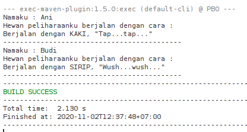
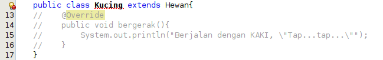
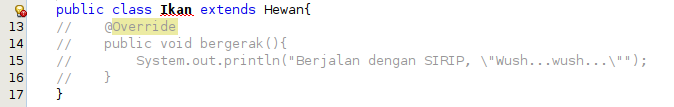
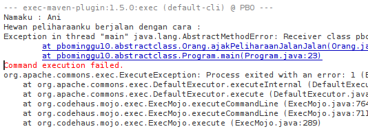
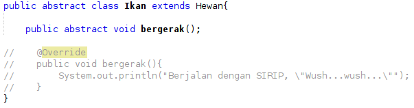
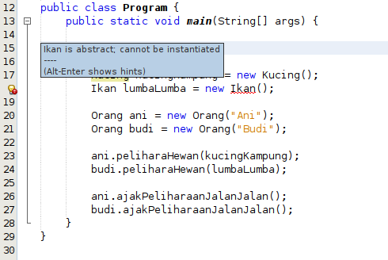

# LAPORAN TUGAS PRAKTIKUM PBO || MINGGU 10

### Pertanyaan Percobaan

1. Berikan penjelasan terkait tentang jalannya program diatas

   **Jawab :** Program diatas menggunakan metode abstract class, dimana pada class Hewan terdapat method yang tidak ada isi nya atau method yang kosong yang hanya ada nama method nya saja. akan tetapi method abstract tersebut berfungsi sebagai deklarasi method umum yang nantinya akan digunakan pada class turunannya. Didalam class turunannya, method abstract tersebut akan diperjelas lagi mengenai isi dari method tersebut yang menggambarkan lebih spesifik dari objek class tersebut.

2. Tunjukkan hasil kompilasi program dan berikan penjelasan singkat jika method bergerak() diubah menjadi method abstract!

   **Jawab :**

   

   Method bergerak() menampilkan hasil yang spesifik sesuai objek class turunan nya masing-masing. Dimana method bergerak() yang sudah dideklarsikan di class parent akan direplace lebih spesifik untuk setiap class turunannya.

3. Tunjukkan hasil kompilasi program dan berikan penjelasan singkat jika tidak dilakukan overriding terhadap method bergerak()

   **Jawab :**

    

   > Output Program

   

   Program akan error ketika dijalankan, karena jika class parent sudah dideklarasikan sebagai abstract class maka class turunannya harus memiliki method abstract yang sudah dideklrasikan di class parent atau di-override.

4. Tunjukkan hasil kompilasi program dan berikan penjelasan singkat jika abstract method bergerak() yang dideklarasikan dalam Class Ikan

   **Jawab :**

   Pada class Ikan akan ditambahkan method abstract bergerak();

   

   Akan tetapi pada class Program terjadi notif error dikarenakan untuk class Abstract tidak dapat diinstansiasi .

   
