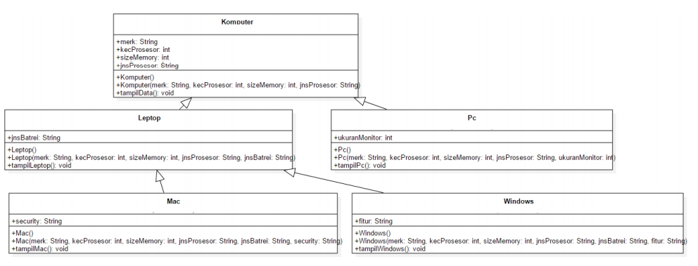
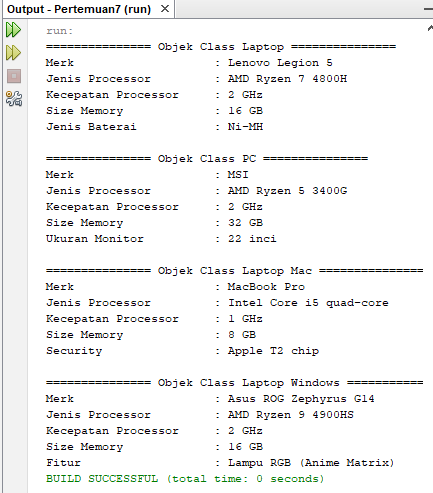

# LAPORAN TUGAS PRAKTIKUM | PERTEMUAN 7

## Class Diagram



## Kode Program

> Class Komputer

```
package src.Tugas;

/**
 *
 * @author Master
 */
public class Komputer {
    public String merk, jnsProcessor;
    public int kecProcessor, sizeMemory;

    public Komputer() {
    }

    public Komputer(String merk, String jnsProcessor, int kecProcessor, int sizeMemory) {
        this.merk = merk;
        this.jnsProcessor = jnsProcessor;
        this.kecProcessor = kecProcessor;
        this.sizeMemory = sizeMemory;
    }

    public void tampilData(){
        System.out.println("Merk\t\t\t: " + merk);
        System.out.println("Jenis Processor\t\t: " + jnsProcessor);
        System.out.println("Kecepatan Processor\t: " + kecProcessor + " GHz");
        System.out.println("Size Memory\t\t: " + sizeMemory + " GB");
    }
}
```

> Class Laptop

```
package src.Tugas;

/**
 *
 * @author Master
 */
public class Laptop extends Komputer{
    public String jnsBaterai;

    public Laptop() {
    }

    public Laptop(String jnsBaterai, String merk, String jnsProcessor, int kecProcessor, int sizeMemory) {
        super(merk, jnsProcessor, kecProcessor, sizeMemory);
        this.jnsBaterai = jnsBaterai;
    }

    public void tampilLaptop(){
        super.tampilData();
        System.out.println("Jenis Baterai\t\t: " + jnsBaterai);
    }
}
```

> Class Pc

```
package src.Tugas;

/**
 *
 * @author Master
 */
public class Pc extends Komputer{
    public int ukuranMonitor;

    public Pc() {
    }

    public Pc(int ukuranMonitor, String merk, String jnsProcessor, int kecProcessor, int sizeMemory) {
        super(merk, jnsProcessor, kecProcessor, sizeMemory);
        this.ukuranMonitor = ukuranMonitor;
    }

    public void tampilPc(){
        super.tampilData();
        System.out.println("Ukuran Monitor\t\t: "+ukuranMonitor + " inci");
    }
}
```

> Class Mac

```
package src.Tugas;

/**
 *
 * @author Master
 */
public class Mac extends Laptop{
    public String security;

    public Mac() {
    }

    public Mac(String security, String jnsBaterai, String merk, String jnsProcessor, int kecProcessor, int sizeMemory) {
        super(jnsBaterai, merk, jnsProcessor, kecProcessor, sizeMemory);
        this.security = security;
    }

    public void tampilMac(){
        super.tampilData();
        System.out.println("Security\t\t: "+security);
    }
}
```

> Class Windows

```
package src.Tugas;

/**
 *
 * @author Master
 */
public class Windows extends Laptop{
    public String fitur;

    public Windows() {
    }

    public Windows(String fitur, String jnsBaterai, String merk, String jnsProcessor, int kecProcessor, int sizeMemory) {
        super(jnsBaterai, merk, jnsProcessor, kecProcessor, sizeMemory);
        this.fitur = fitur;
    }

    public void tampilWindows(){
        super.tampilData();
        System.out.println("Fitur\t\t\t: " + fitur);
    }

}
```

> Class Main

```
package src.Tugas;

/**
 *
 * @author Master
 */
public class Main {
    public static void main(String[] args) {
        System.out.println("=============== Objek Class Laptop ===============");
        Laptop L = new Laptop("Ni-MH", "Lenovo Legion 5", "AMD Ryzen 7 4800H", 2, 16);
        L.tampilLaptop();

        System.out.println("");

        System.out.println("=============== Objek Class PC ===============");
        Pc P = new Pc(22, "MSI", "AMD Ryzen 5 3400G", 2 , 32);
        P.tampilPc();

        System.out.println("");

        System.out.println("=============== Objek Class Laptop Mac ===============");
        Mac M = new Mac("Apple T2 chip", "Ni-MH", "MacBook Pro", "Intel Core i5 quad-core", 1, 8);
        M.tampilMac();

        System.out.println("");

        System.out.println("=============== Objek Class Laptop Windows ===============");
        Windows W = new Windows("Lampu RGB (Anime Matrix)", "Ni-MH", "Asus ROG Zephyrus G14", "AMD Ryzen 9 4900HS", 2, 16);
        W.tampilWindows();
    }
}
```

## Output Program


