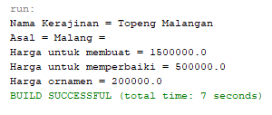

# LAPORAN UTS PRAKTIKUM PBO

## Class

> Class Kerajinan

```
package uts;

/**
 *
 * @author Master
 */
public class Kerajinan {
    public String nama, asal;
    public float harga;

    public void buatKerajinan(){
        this.harga = 1000000;
    }

    public void perbaikiKerajinan(){
        this.harga = 500000;
    }
}
```

> Class Topeng

```
package uts;

/**
 *
 * @author Master
 */
public class Topeng extends Kerajinan{
    public Ornamen ornamen;

    public Topeng(String asal, String namaKerajinan, Ornamen ornamen) {
        super.asal = asal;
        super.nama = namaKerajinan;
        this.ornamen = ornamen;
    }

    public void buatKerajinan(){
        super.harga = 1500000;
    }
}
```

> Class Ornamen

```
package uts;

/**
 *
 * @author Master
 */
public class Ornamen {
    public float harga;

    public Ornamen(float harga){
        this.harga = harga;
    }
}
```

> Class KerajinanDemo

```
package uts;

/**
 *
 * @author Master
 */
public class KerajinanDemo {
    public static void main(String[] args) {
        Topeng topeng = new Topeng("Malang = ", "Topeng Malangan", new Ornamen(200000));
        topeng.buatKerajinan();
        System.out.println("Nama Kerajinan = " + topeng.nama);
        System.out.println("Asal = " + topeng.asal);
        System.out.println("Harga untuk membuat = " + topeng.harga);
        topeng.perbaikiKerajinan();
        System.out.println("Harga untuk memperbaiki = "+ topeng.harga);
        System.out.println("Harga ornamen = "+ topeng.ornamen.harga);
    }
}
```

## Output Program


